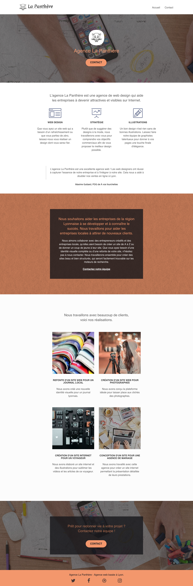
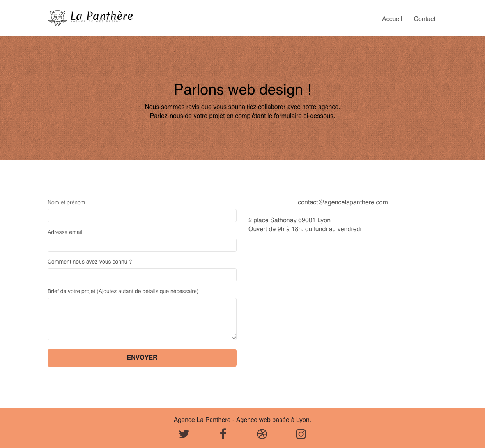

# La Panthère

Projet n°4 du [parcours Développeur Web](https://openclassrooms.com/fr/paths/556-developpeur-web#path-tabs) d'OpenClassrooms : _Optimisez un site web existant_.

> Il s'agit d'améliorer les performances, le référencement et de rendre un site déjà existant plus accessible en respectant les critères WCAG.

## 📚 Outils utilisées

- Performances : [GTmetrix](https://gtmetrix.com/)
- SEO : [Lighthouse](https://chrome.google.com/webstore/detail/lighthouse/blipmdconlkpinefehnmjammfjpmpbjk?hl=fr)
- Accessibilité : [Wave WebAccessibility](https://www.webaccessibility.com) et [Wave](https://wave.webaim.org/)

## 📎 Rendu visuel

## 💻 Démo du site

[La Panthère](https://clementstorne.github.io/La-Panthere/)
